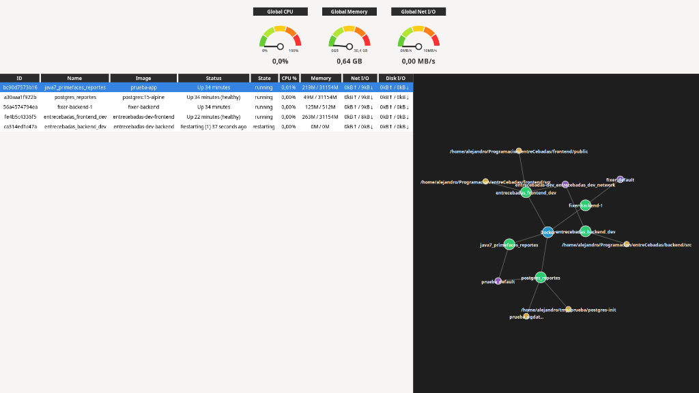

# cDockerStats

cDockerStats es una aplicación de escritorio nativa escrita en **C** con la biblioteca gráfica **GTK4** diseñada para el monitoreo avanzado de contenedores Docker en tiempo real. 

La herramienta proporciona una vista unificada que incluye métricas globales del host y los contenedores, listados detallados de consumo, y un mapa topológico que muestra cómo los contenedores se comunican a través de sus distintas redes Docker.



## Características Principales

- **Dashboard de Métricas Globales**: Monitores radiales con valores y porcentajes en tiempo real sobre la carga de CPU, consumo total de Memoria RAM (basado en la memoria física del equipo) y ancho de banda global de Red I/O.
- **Grilla Analítica**: Una tabla alineada dinámicamente que muestra el `ID`, `Nombre`, `Imagen`, `Status` (uptime/reiniciando) y recursos consumidos para cada contenedor.
- **Grafo Dinámico de Redes**: Visualización topológica generada mediante el motor `Graphviz`. Dibuja nodos para los contenedores y las redes a las que están adjuntos.
- **Acciones sobre los Contenedores**: Menú contextual para detener, inspeccionar o reiniciar contenedores desde la UI.

## Dependencias

Para compilar y ejecutar el proyecto, necesitarás las siguientes herramientas y bibliotecas de desarrollo en tu sistema GNU/Linux:

- `gcc`
- `make`
- `pkg-config`
- `libgtk-4-dev` (GTK4)
- `libcurl4-openssl-dev` (libcurl)
- `libjson-glib-dev` (json-glib-1.0)
- `libgraphviz-dev` (libgvc, libcgraph)

## Compilación y Uso

El proyecto utiliza `make` para automatizar su construcción a partir de las dependencias. Para compilar y correr:

1. Ingresa al directorio raíz de **cDockerStats**.
2. Ejecuta el comando `make` para iniciar el proceso de compilación automática. Esto transformará los archivos de `src/` en archivos objeto `.o` temporales y luego los enlazará.
   ```bash
   make
   ```
3. El ejecutable compilado aparecerá en el nuevo directorio `bin/`. Corre el binario para iniciar la aplicación visual:
   ```bash
   ./bin/cDockerStats
   ```

*(Nota: Tienes a disposición `make clean` si deseas borrar los ejecutables y archivos de objeto cacheados de antiguas compilaciones).*

## Estructura del Proyecto

```text
cDockerStats/
├── bin/          # Directorio resultante donde se compila el ejecutable (cDockerStats).
├── includes/     # Archivos de cabecera (.h) utilizados para declaraciones e interfaces.
├── src/          # Código fuente en C (.c) para toda la lógica de negocio y UI.
├── test/         # Programas modulares e independientes de testeo.
├── assets/       # Imágenes, logotipos u otros archivos estáticos adjuntos.
└── Makefile      # Archivo con las reglas de enlazado y compilación.
```

## Licencia

Este programa es software libre: puede redistribuirlo y/o modificarlo bajo los términos de la **Licencia Pública General de GNU (GPL) versión 3**, publicada por la Free Software Foundation. 
